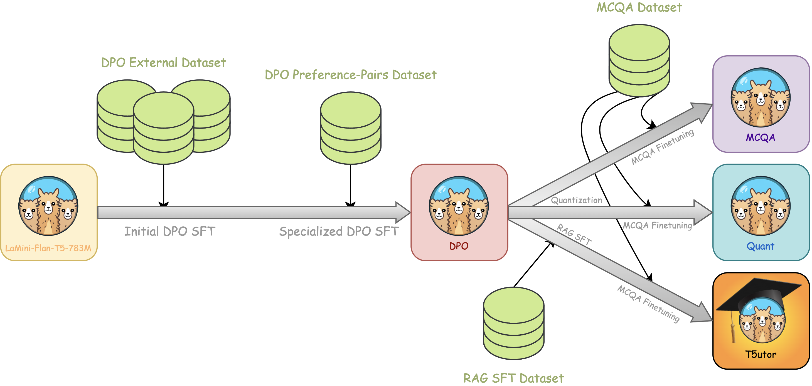
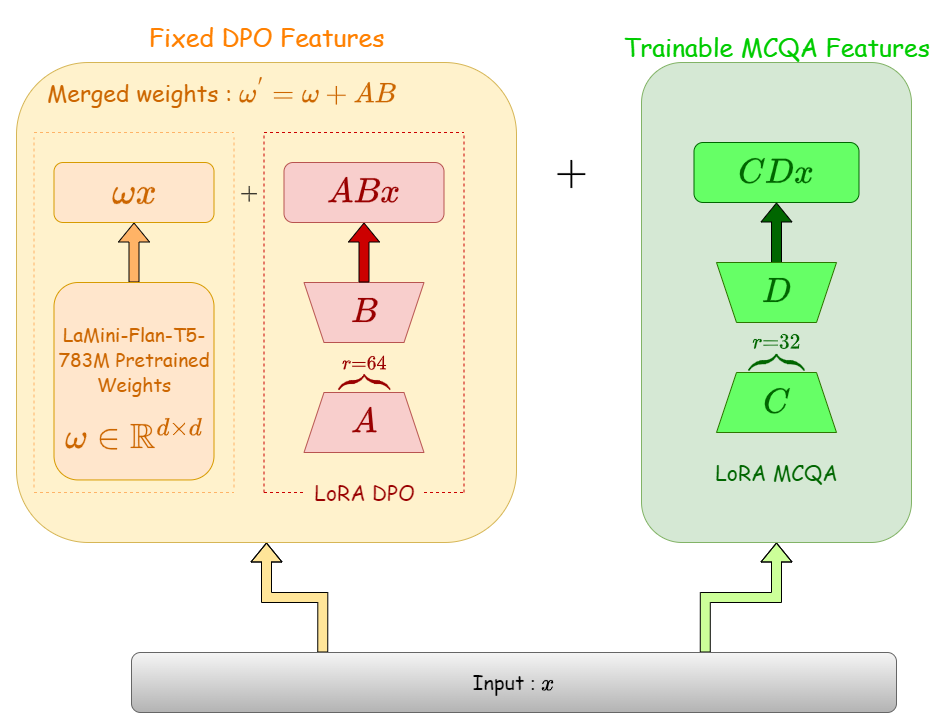
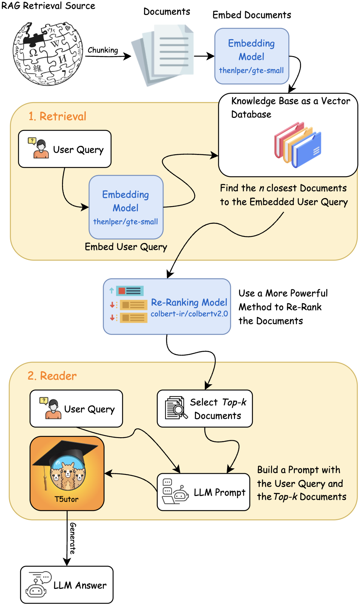

# From Attention to Education: T5utor Is Really All You Need

## Abstract
Language models (LMs) have a wide range of practical applications in the education sector, where they can enhance the development of personalized teaching and provide tutoring for student communities lacking standard educational resources.

We have built an educational assistant using Flan-T5 large, a modestly sized language model capable of running on consumer hardware, which students can use to assist them in question-answering tasks. To further increase its capabilities, we have incorporated Retrieval-Augmented Generation (RAG) to leverage a large knowledge database. Additionally, we utilized 4-bit quantization to create a more memory-efficient model, which is crucial for effectively democratizing access to LLMs.

Model quantization results in a 68% reduction in memory footprint without severely impacting performance, maintaining a 32% accuracy. Furthermore, our flagship model, T5utor, utilizing RAG, increased performance by 4.4% compared to our Multiple Choice Question Answering (MCQA) model. After our training pipelines, some of the models achieve higher accuracies on common benchmarks relative to the reference model.

## Approach
  
*Figure 1: Diagram showing our general approach. Starting from the left with our chosen generator model LaMini-Flan-T5-783M, then going through multiple fine-tuning stages. The names of the models follow the nomenclature in Table 1. The relative sizes of the datasets are also significant, with the DPO External Dataset being roughly six times the size of the other smaller datasets.*

### SFT with PEFT

*Figure 2: Diagram illustrating our mixed LoRA architecture. Weights on the left block are freezed, only the additional LoRA layer depicted in green is optimized.*

### RAG Pipeline

*Figure 3: We used an Advanced RAG approach a the inference stage leveraging the specialized framework LangChain and a retrieval source.*
